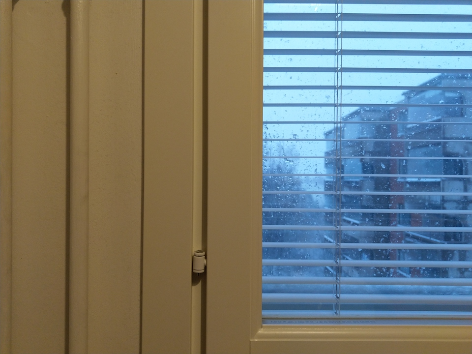

# Hello website
Welcome to the CS-E4101 Introduction to DevOps course!

**About me**

My name is Tomi and I have about 15 years experience of software design and testing. Currently I am studying this introduction course to DevOps and a web course called Practical Programming in Python by University of Tampere. I have had a desktop computer since I was 20 years old and I have always enjoyed upgrading it with new parts. However, I haven’t been so interested in programming as a hobby until quite recently. 

This new programming hobby isn not yet on very high level. I have done many Python exercises and simple scripts for test automation. I have also been writing test cases with Robot Framework. This combination is something that would like to do as my profession. My earlier experience was with C/C++, so it hasn’t been so difficult to learn for example Python. Most of challenges are more like figuring out thow to solve a problem than how to write the correct syntax for the algoritm.

**My Diary** 

[Diary](diary-046.md)

**Photo**

